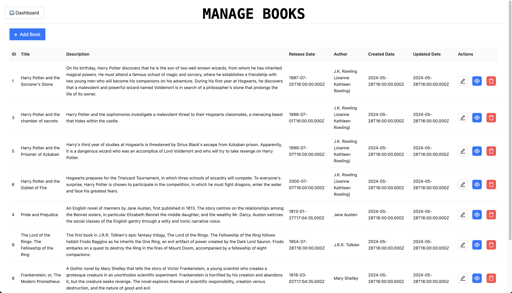

# Learn It Right Way
This project is a full-stack web application built using React js for the frontend, Express js for the backend, and MySQL as the database. The application is designed to demonstrate the implementation of a 3-tier architecture, where the presentation layer (React js), application logic layer (Express js), and data layer (MySQL) are separated into distinct tiers.


## User Interface Screenshots 
#### Dashboard


#### Books


#### Authors


## Setting up the Presentation Tier

# conncet to your  front end instance
#### Install GIT
```
sudo yum update -y

sudo yum install git -y

git — version
```

#### Install node.js
1. To install node version manager (nvm)
```
curl -fsSL https://rpm.nodesource.com/setup_18.x | sudo bash -
sudo yum install -y nodejs
```
### Install httpd (apache)
```
sudo yum install httpd -y
sudo systemctl start httpd
sudo systemctl enable httpd
```
#### Clone repository
```
git clone https://github.com/CloudTechDevOps/fullstack-autors-books-application.git
```
###Switch to frontend
```
cd fullstack-authors-books-application
cd frontend
```
### In frontend path .env file is there if not existis please create .env file 
```
VITE_API_URL=http://3.85.56.86/api   // put your backend public ip or dns name 
```
#### Run the following commnads in frontend 
```
npm install
npm run build
sudo cp -r dist/* /var/www/html/
```

### Now access the frontend with public ip 

# Setting up the Data Tier

```
create a rds database in sasme vpc
```
### Setting up the Application Tier

## conncet to your  backend instance

#### Install GIT
```
sudo yum update -y

sudo yum install git -y

git — version
```

#### Install node.js
1. To install node version manager (nvm)
```
curl -fsSL https://rpm.nodesource.com/setup_18.x | sudo bash -
sudo yum install -y nodejs
```
### Install pm2
```
sudo npm install -g pm2
mkdir -p ~/.npm-global
npm config set prefix '~/.npm-global'
export PATH="$HOME/.npm-global/bin:$PATH"
echo 'export PATH="$HOME/.npm-global/bin:$PATH"' >> ~/.bashrc && source ~/.bashrc
npm install -g pm2
```
### Install mysql or mariadb for database initilization
```
sudo yum install mariadb105-server -y
```
#### Clone repository
```
git clone https://github.com/CloudTechDevOps/fullstack-autors-books-application.git
```
### Switch to backend
```
cd fullstack-authors-books-application
cd backend
```
### change the database details  in db.js
### *** vi configs/db.js***
```
const mysql = require('mysql2');

const db = mysql.createConnection({
   host: 'rds endpoint',
   port: '3306',
   user: 'radmin',
   password: 'rds-password',
   database: 'react_node_app'
});

module.exports = db;
```
### Initilize the database 
```
mysql -h <rdsendpoint> -u admin -p<rdspassword> < db.sql
mysql -h database-1.cj6qigogwls0.us-east-1.rds.amazonaws.com -u admin -pveeradon < db.sql

```
### Everything is completed run the follwing commnds for backend execution
```
npm install
pm2 start server.js --name "veera"
pm2 startup
sudo systemctl enable pm2-root
sudo pm2 save
```
### hit public ip you will get this responce 
#### Dashboard


### add the autors and books 
                                                   thank you 

